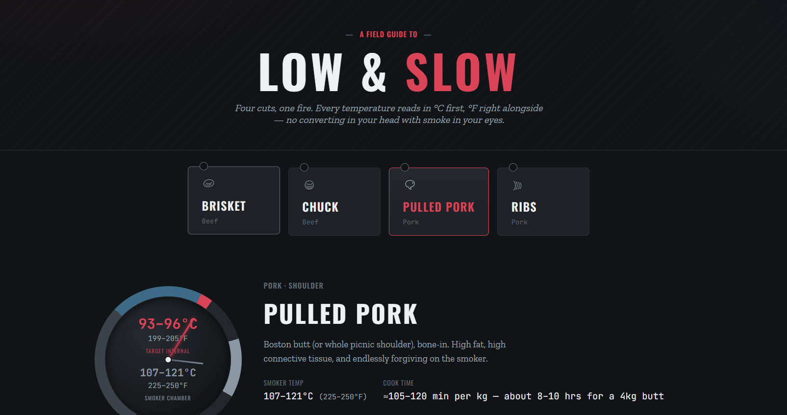

# Low & Slow — A Smoker Field Guide

A lightweight, installable Progressive Web App with the temps, times, rubs, and technique for smoking brisket, chuck, beef ribs, pulled pork, and pork ribs — plus recipes for the sides that go with them. Every temperature reads in °C first, °F right alongside, so there's no converting in your head with smoke in your eyes.

## Features

- **Five cuts, one fire** — Brisket, Chuck Roast, Beef Ribs, Pulled Pork, and Pork Ribs, each with a target-internal and smoker-chamber dial, dry rub, step-by-step method, wood pairings, and pitmaster notes.
- **Six sides** — Smoked Beans, Smoked Mac & Cheese, Smoked Corn, Jalapeño Cornbread, Creamy Coleslaw, and Pickled Red Onions, each with a full ingredients list and method.
- **°C / °F toggle** — switch units once and every dial, stat, and step updates, with your preference remembered on return visits.
- **Installable PWA** — works offline after the first load and can be installed to the home screen / app list on Android, desktop Chrome/Edge, and iOS Safari (via an in-app "Add to Home Screen" prompt).

Internal temperatures in this guide are guidelines, not guarantees — always cook to tenderness, not just the number.
